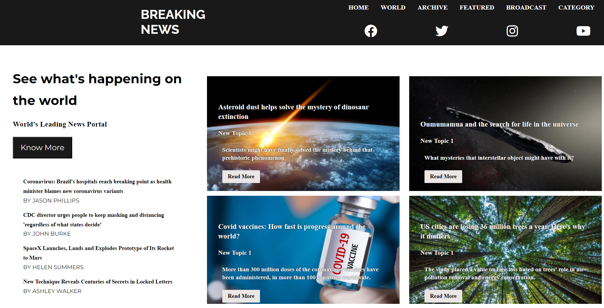

# News Portal Website



Welcome to our News Portal website! This project aims to provide users with up-to-date news from various categories. It's built using HTML, CSS, and JavaScript, and it offers a clean and user-friendly interface for accessing news articles.

## Features

- **Latest News**: Stay informed with the most recent and trending news stories.
- **Categories**: Easily navigate through different news categories, including World, Technology, Politics, Sports, and more.
- **Search**: Find specific articles by using our powerful search feature.
- **Responsive Design**: Our website adapts to different devices, ensuring a seamless experience on desktops, tablets, and smartphones.

## Website Preview


## Getting Started

To run the News Portal website locally, follow these steps:

1. Clone this repository to your local machine using the following command:

```
git clone https://github.com/your-username/news-portal.git
```

2. Open the `index.html` file in your preferred web browser.

3. Start exploring the latest news articles!

## Contributing

We welcome contributions from the community to improve and expand this News Portal website. If you'd like to contribute, follow these steps:

1. Fork this repository to your GitHub account.

2. Create a new branch with a descriptive name for your feature or bug fix.

3. Make your changes and commit them with clear and concise messages.

4. Push your changes to your forked repository.

5. Create a pull request, and we'll review your contribution.

## Feedback

We value your feedback! If you encounter any issues, have suggestions for improvements, or want to request new features, please feel free to open an issue in this repository.

## Credits

- [OMKAR](https://github.com/Omkaarr1): Project Developer

## License

This project is licensed under the [MIT License](LICENSE).

---

Thank you for visiting our News Portal website! We hope you find it informative and enjoyable. Stay updated with the latest news and keep exploring!
